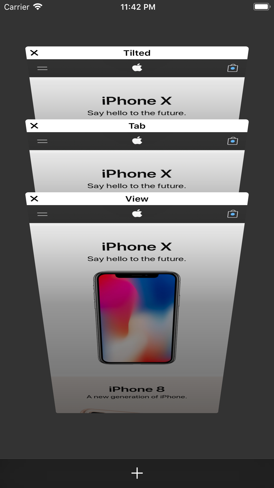
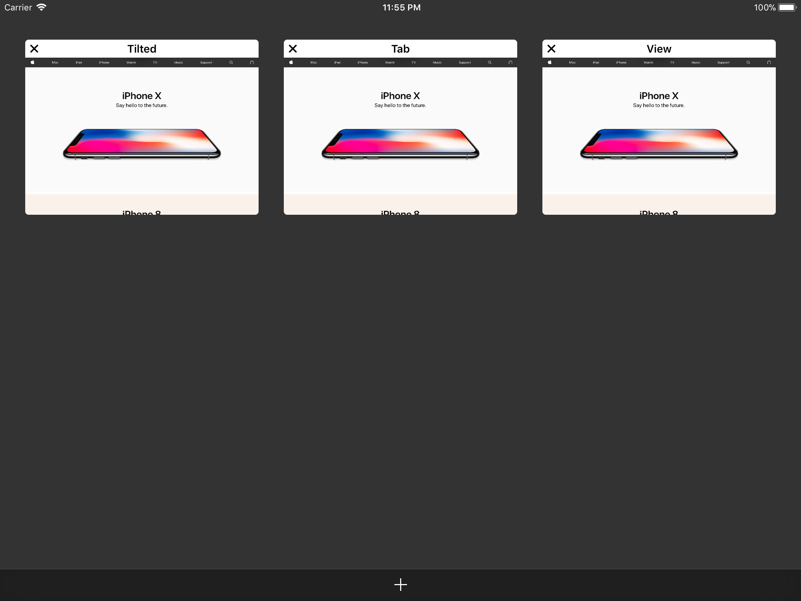

# Tilted Tab View

<p align="center">
  <b>TiltedTabView</b> &bull;
  <a href="https://github.com/IMcD23/TabView">TabView</a> &bull;
  <a href="https://github.com/IMcD23/InputAssistant">InputAssistant</a> &bull;
  <a href="https://github.com/IMcD23/Git">Git</a>
</p>

--------

This library aims to replicate the tab switcher in Safari on iOS. It handles both compact width (tilted) and regular width (grid) layouts.

[](https://travis-ci.org/IMcD23/TiltedTabView)
[](https://github.com/IMcD23/TiltedTabView/releases/latest)

[](https://twitter.com/ian_mcdowell)

  

# Requirements

* Xcode 9 or later
* iOS 10.0 or later

# Usage

The main class in this library is the TiltedTabViewController. It is a subclass of UICollectionViewController, that contains a custom collection view and layout.

To get started, create a view controller that subclasses TiltedTabViewController

The TiltedTabViewController has data source and delegate properties, similar to those of a UICollectionView.

Set an object that conforms to the TiltedTabViewControllerDataSource and TiltedTabViewControllerDelegate protocols as the dataSource and delegate properties, respectively.

Provide implementations for all required methods of each protocol, and you're off to the races.

# Installation

## Carthage
To install TiltedTabView using [Carthage](https://github.com/Carthage/Carthage), add the following line to your Cartfile:

```
github "IMcD23/TiltedTabView" "master"
```

## Submodule
To install TiltedTabView as a submodule into your git repository, run the following command:

```
git submodule add -b master https://github.com/IMcD23/TiltedTabView.git Path/To/TiltedTabView
git submodule update --init --recursive
```

Then, add the `.xcodeproj` in the root of the repository into your Xcode project, and add it as a build dependency.

## ibuild
A Swift static library of this project is also available for the ibuild build system. Learn more about ibuild [here](https://github.com/IMcD23/ibuild)

# Author
Created by [Ian McDowell](https://ianmcdowell.net)

# License
All code in this project is available under the license specified in the LICENSE file. However, since this project also bundles code from other projects, you are subject to those projects' licenses as well.
